<p align="center">
  
</p>

<h1 align="center">CerebroCortex</h1>
<h3 align="center"><em>A brain that remembers like a brain.</em></h3>

<p align="center">
  <a href="#quick-start"></a>
  <a href="LICENSE"></a>
  <a href="#testing"></a>
  <a href="#brain-regions"></a>
  <a href="#memory-types"></a>
  <a href="#dream-engine"></a>
</p>

<p align="center">
  <a href="#architecture">Architecture</a> &bull;
  <a href="#quick-start">Quick Start</a> &bull;
  <a href="#brain-regions">Brain Regions</a> &bull;
  <a href="#multi-agent-memory">Multi-Agent</a> &bull;
  <a href="#dream-engine">Dream Engine</a> &bull;
  <a href="#interfaces">Interfaces</a> &bull;
  <a href="#agent-framework-integration">Integration</a> &bull;
  <a href="#dashboard">Dashboard</a>
</p>

---

CerebroCortex is a **brain-analogous memory system for AI agents**. It doesn't just store and retrieve text — it *encodes*, *associates*, *consolidates*, and *dreams*, using the same cognitive architecture that makes biological memory so powerful.

Built for the [Model Context Protocol (MCP)](https://modelcontextprotocol.io), it gives Claude (or any LLM) persistent, associative, emotionally-weighted memory that strengthens with use, decays with neglect, and reorganizes itself while it sleeps.

> **TL;DR** — Imagine if your AI assistant had a hippocampus, an amygdala, and could dream.
> That's CerebroCortex.

---

## Why CerebroCortex?

Most AI memory systems are **glorified vector databases** — dump text in, cosine-similarity it back out. That works for search. It doesn't work for *memory*.

Real memory is:

| What real memory does | What vector DBs do | What CerebroCortex does |
|---|---|---|
| **Associates** — links ideas by meaning, emotion, causality | Returns top-k similar docs | 9 typed link types + spreading activation through an associative graph |
| **Forgets intelligently** — old unused memories fade | Stores everything forever | ACT-R power-law decay + FSRS spaced-repetition |
| **Strengthens with use** — frequently recalled memories persist | Static similarity scores | Hebbian "neurons that fire together wire together" strengthening |
| **Has emotional weight** — traumatic/joyful moments stick | All memories are equal | Amygdala engine scores valence + arousal, boosts salience |
| **Consolidates offline** — sleep reorganizes and prunes | Nothing | 6-phase Dream Engine with LLM-powered pattern extraction |
| **Layers memories** — sensory -> working -> long-term -> cortex | Flat storage | 4-layer promotion system with configurable decay |

---

## Architecture

```mermaid
graph TB
    subgraph Interfaces["🔌 Interfaces"]
        MCP["MCP Server<br/><small>40 tools</small>"]
        API["REST API<br/><small>30+ endpoints</small>"]
        CLI["CLI<br/><small>cerebro</small>"]
        DASH["Dashboard<br/><small>Cyberpunk UI</small>"]
    end

    subgraph Cortex["🧠 CerebroCortex Coordinator"]
        REM["remember()"]
        REC["recall()"]
        ASS["associate()"]
        EPI["episode_*()"]
    end

    subgraph Engines["⚡ Brain Region Engines"]
        TH["Thalamus<br/><small>Gating</small>"]
        AM["Amygdala<br/><small>Affect</small>"]
        TL["Temporal Lobe<br/><small>Semantics</small>"]
        HC["Hippocampus<br/><small>Episodes</small>"]
        AC["Association Cortex<br/><small>Linking</small>"]
        CB["Cerebellum<br/><small>Procedural</small>"]
        PF["Prefrontal Cortex<br/><small>Executive</small>"]
        NC["Neocortex<br/><small>Schemas</small>"]
        DR["Default Mode Network<br/><small>Dream Engine</small>"]
    end

    subgraph Activation["📐 Activation System"]
        ACTR["ACT-R<br/><small>B(t) = ln(Σ t_k⁻ᵈ)</small>"]
        FSRS["FSRS<br/><small>R(t,S) = (1+t/9S)⁻¹</small>"]
        SA["Spreading Activation<br/><small>Collins & Loftus</small>"]
    end

    subgraph Storage["💾 Triple-Backend Storage"]
        SQ["SQLite<br/><small>Persistent graph</small>"]
        IG["igraph<br/><small>In-memory traversal</small>"]
        CH["ChromaDB<br/><small>Vector search</small>"]
    end

    MCP --> Cortex
    API --> Cortex
    CLI --> Cortex
    DASH --> API
    Cortex --> Engines
    Engines --> Activation
    Engines --> Storage
    Activation --> Storage

    style Interfaces fill:#1a1a2e,stroke:#00ff41,color:#00ff41
    style Cortex fill:#1a1a2e,stroke:#00d4ff,color:#00d4ff
    style Engines fill:#1a1a2e,stroke:#ff0055,color:#ff0055
    style Activation fill:#1a1a2e,stroke:#ffd700,color:#ffd700
    style Storage fill:#1a1a2e,stroke:#9d4edd,color:#9d4edd
```



---

## Quick Start

### Install

```bash
git clone https://github.com/buckster123/CerebroCore.git
cd CerebroCore
pip install -e ".[all]"
```

### Run as MCP Server (for Claude, OpenClaw, or any MCP client)

```bash
./cerebro-mcp
```

Add to your Claude config (`~/.claude.json`) or OpenClaw MCP config:

```json
{
  "mcpServers": {
    "cerebro-cortex": {
      "command": "/path/to/CerebroCore/cerebro-mcp"
    }
  }
}
```

Optionally set an agent identity via environment variable:

```bash
CEREBRO_AGENT_ID=my-agent ./cerebro-mcp
```

### Run as REST API

```bash
./cerebro-api
# → http://localhost:8767
# → Dashboard at http://localhost:8767/ui
```

### Use the CLI

```bash
# Store a memory
cerebro remember "The mitochondria is the powerhouse of the cell" --type semantic

# Search memories
cerebro recall "cell biology" -n 5

# Check stats
cerebro stats

# Run the Dream Engine
cerebro dream --run
```

### Python API

```python
from cerebro.cortex import CerebroCortex
from cerebro.types import MemoryType, LinkType, Visibility

brain = CerebroCortex()
brain.initialize()

# Remember (with multi-agent support)
node = brain.remember(
    "Deployment failed due to missing env var DATABASE_URL",
    memory_type=MemoryType.EPISODIC,
    tags=["deployment", "bug"],
    salience=0.8,
    agent_id="ALICE",                  # Which agent owns this
    visibility=Visibility.SHARED,       # SHARED, PRIVATE, or THREAD
)

# Recall (scoped to agent's visible memories)
results = brain.recall("deployment issues", top_k=5, agent_id="BOB")
for memory, score in results:
    print(f"  [{score:.2f}] {memory.content[:80]}")

# Associate
brain.associate(node.id, other_id, LinkType.CAUSAL, weight=0.9)

brain.close()
```

---

## Brain Regions

CerebroCortex maps 9 engines to their biological counterparts. Each engine handles a specific cognitive function, just like the real brain:

```mermaid
graph LR
    INPUT["📥 Input"] --> TH

    subgraph Encoding["Encoding Pipeline"]
        TH["🫁 Thalamus<br/>Gating & Filtering"]
        TL["🧩 Temporal Lobe<br/>Concept Extraction"]
        AM["❤️ Amygdala<br/>Emotional Analysis"]
    end

    subgraph Association["Association & Storage"]
        AC["🔗 Association Cortex<br/>Auto-Linking"]
        HC["🐴 Hippocampus<br/>Episode Binding"]
        CB["🎯 Cerebellum<br/>Procedural Memory"]
    end

    subgraph Executive["Executive & Abstraction"]
        PF["🎓 Prefrontal Cortex<br/>Ranking & Promotion"]
        NC["🌐 Neocortex<br/>Schema Formation"]
    end

    subgraph Offline["Offline Consolidation"]
        DR["💤 Default Mode Network<br/>Dream Engine"]
    end

    TH --> TL --> AM --> AC
    AC --> HC
    AC --> CB
    HC --> PF
    CB --> PF
    PF --> NC
    NC --> DR
    DR -.->|"strengthens"| AC

    style Encoding fill:#0d1117,stroke:#00ff41,color:#c9d1d9
    style Association fill:#0d1117,stroke:#00d4ff,color:#c9d1d9
    style Executive fill:#0d1117,stroke:#ffd700,color:#c9d1d9
    style Offline fill:#0d1117,stroke:#9d4edd,color:#c9d1d9
```



| Engine | Brain Region | What It Does |
|---|---|---|
| **GatingEngine** | Thalamus | First line of defense. Filters noise, detects duplicates, assigns memory layer, estimates initial salience. If it's not worth remembering, it dies here. |
| **AffectEngine** | Amygdala | Emotional processor. Scores valence (positive/negative/mixed) and arousal (calm→intense). High-emotion memories get salience boosts — just like real trauma and joy. |
| **SemanticEngine** | Temporal Lobe | Concept extractor. Identifies key concepts, creates semantic links between related memories, detects contradictions. |
| **EpisodicEngine** | Hippocampus | Episode manager. Binds memories into temporal sequences (episodes), tracks context flow, enables "what happened during X" retrieval. |
| **LinkEngine** | Association Cortex | The connector. Auto-links new memories to related ones, runs spreading activation, applies Hebbian strengthening ("fire together, wire together"). |
| **ProceduralEngine** | Cerebellum | Skill memory. Identifies workflows, strategies, and repeatable patterns. Tracks success/failure to reinforce what works. |
| **ExecutiveEngine** | Prefrontal Cortex | The executive. Ranks recall results, decides layer promotions (working→long-term), manages prospective memory (TODOs). |
| **SchemaEngine** | Neocortex | The abstractifier. Extracts general principles from specific episodes. "3 deployments failed from missing env vars" → schema: "always validate env before deploy". |
| **DreamEngine** | Default Mode Network | Offline consolidation. Replays, clusters, abstracts, prunes, and recombines — exactly like biological sleep. Details [below](#dream-engine). |

---

## Memory Types

Six modalities, modeled after human cognitive memory research:


| Type | Analogy | Example |
|---|---|---|
| **Episodic** | Diary entry | "During the 2024-03-15 deploy, the DB migration failed at step 4" |
| **Semantic** | Encyclopedia | "PostgreSQL supports JSONB columns for semi-structured data" |
| **Procedural** | Recipe | "To deploy: run tests → build image → push → apply k8s manifests" |
| **Affective** | Gut feeling | "Last time we rushed a Friday deploy, it went badly — high anxiety" |
| **Prospective** | Sticky note | "TODO: Migrate user table to new schema before v2 launch" |
| **Schematic** | Mental model | "Schema: Services that skip staging tend to have 3x more prod incidents" |

---

## The Activation System

This is where CerebroCortex diverges from every other memory system. Instead of static similarity scores, memories have *dynamic activation levels* that change over time.

### Combined Recall Score

Every memory retrieval produces a score blending four signals:


```
score = 0.35 × vector_similarity
      + 0.30 × actr_activation
      + 0.20 × fsrs_retrievability
      + 0.15 × salience
```

---

<details>
<summary><strong>🔬 Deep Dive: ACT-R Base-Level Activation</strong></summary>

### ACT-R — Adaptive Control of Thought (Rational)

CerebroCortex implements the **base-level activation equation** from John Anderson's ACT-R cognitive architecture (Carnegie Mellon, 1993):

```
B(t) = ln( Σ t_k^{-d} )
```

Where:
- `t_k` = time since the k-th access (in seconds)
- `d` = decay rate (default: **0.5** — square-root power law)
- The sum runs over all recorded access timestamps

**What this means in practice:**
- A memory accessed once 10 minutes ago has *higher* activation than one accessed once 10 days ago
- A memory accessed 50 times over months has *higher* activation than one accessed twice yesterday
- Activation follows a **power law**, not exponential — old memories don't vanish, they just get quieter

**Parameters:**

| Parameter | Value | Meaning |
|---|---|---|
| `ACTR_DECAY_RATE` | 0.5 | Power-law exponent (higher = faster decay) |
| `ACTR_NOISE` | 0.4 | Stochastic noise in retrieval (models human variability) |
| `ACTR_RETRIEVAL_THRESHOLD` | 0.0 | Minimum activation to be retrievable |
| `MAX_STORED_TIMESTAMPS` | 50 | Individual timestamps kept; older ones get compressed |

</details>

<details>
<summary><strong>🔬 Deep Dive: FSRS Retrievability</strong></summary>

### FSRS — Free Spaced Repetition Scheduler

Alongside ACT-R, each memory tracks an FSRS-based **retrievability** score using the forgetting curve from modern spaced-repetition research:

```
R(t, S) = (1 + t / (9 × S))^{-1}
```

Where:
- `t` = elapsed time since last review (in days)
- `S` = stability (how long the memory resists forgetting)

**Stability grows with successful recalls.** Every time you access a memory, its stability increases, meaning it takes longer to forget. This models the "spacing effect" — the finding that distributed practice beats massed practice.

| Parameter | Value | Meaning |
|---|---|---|
| `FSRS_INITIAL_STABILITY` | 1.0 day | New memories start fragile |
| `FSRS_INITIAL_DIFFICULTY` | 5.0 / 10 | Mid-range difficulty |
| `FSRS_MIN_STABILITY` | 0.1 days | Floor (2.4 hours) |
| `FSRS_MAX_STABILITY` | 365 days | Ceiling (1 year) |

</details>

<details>
<summary><strong>🔬 Deep Dive: Spreading Activation</strong></summary>

### Collins & Loftus Spreading Activation (1975)

When you recall a memory, activation doesn't stay local — it **spreads** through the associative network to related memories, exactly like priming in human cognition.

```mermaid
graph LR
    A["🟢 Seed Memory<br/>activation: 1.0"] -->|"semantic (0.8)"| B["🟡 Related<br/>activation: 0.48"]
    A -->|"causal (0.9)"| C["🟡 Consequence<br/>activation: 0.54"]
    B -->|"temporal (0.6)"| D["🟠 2nd hop<br/>activation: 0.17"]
    C -->|"supports (0.8)"| E["🟠 Evidence<br/>activation: 0.26"]

    style A fill:#00ff41,stroke:#000,color:#000
    style B fill:#ffd700,stroke:#000,color:#000
    style C fill:#ffd700,stroke:#000,color:#000
    style D fill:#ff6b35,stroke:#000,color:#000
    style E fill:#ff6b35,stroke:#000,color:#000
```



**How it works:**
1. Seed memories start with activation = 1.0
2. Activation flows through links, weighted by link type and link weight
3. Each hop applies a **decay factor** (default: 0.6, so 40% loss per hop)
4. Stops at **max 2 hops** or when activation drops below 0.05
5. Maximum **50 activated nodes** per spread

**Link Type Weights** (how well each type conducts activation):

| Link Type | Weight | Rationale |
|---|---|---|
| `causal` | 0.9 | Cause→effect is the strongest association |
| `semantic` | 0.8 | Conceptual relatedness is highly relevant |
| `supports` | 0.8 | Evidence is closely tied to claims |
| `part_of` | 0.8 | Components are tightly bound to wholes |
| `contextual` | 0.7 | Shared context is moderately relevant |
| `derived_from` | 0.7 | Abstractions connect to source material |
| `temporal` | 0.6 | "Happened around the same time" is weaker |
| `affective` | 0.5 | Emotional similarity is a softer signal |
| `contradicts` | 0.3 | Contradictions are related, but oppositionally |

</details>

---

## Memory Layers

Memories flow through four durability layers, inspired by the Atkinson-Shiffrin multi-store model:

```mermaid
graph LR
    S["🌊 Sensory<br/><small>6hr half-life</small>"] -->|"accessed 2+"| W["⚡ Working<br/><small>72hr half-life</small>"]
    W -->|"accessed 5+ & 24hr old"| LT["🏛️ Long-Term<br/><small>30-day half-life</small>"]
    LT -->|"Dream Engine only"| C["💎 Cortex<br/><small>No decay</small>"]

    style S fill:#1a1a2e,stroke:#00ff41,color:#00ff41
    style W fill:#1a1a2e,stroke:#00d4ff,color:#00d4ff
    style LT fill:#1a1a2e,stroke:#ffd700,color:#ffd700
    style C fill:#1a1a2e,stroke:#ff0055,color:#ff0055
```



| Layer | Half-Life | Promotion Criteria | Description |
|---|---|---|---|
| **Sensory** | 6 hours | Automatic on 2nd access | Raw input buffer. Most memories die here. |
| **Working** | 3 days | 5+ accesses, 24h+ old | Active working memory. Frequent use keeps it alive. |
| **Long-Term** | 30 days | Dream Engine consolidation only | Stable storage. Only the Dream Engine can promote further. |
| **Cortex** | Permanent | — | Crystallized knowledge. No decay. The stuff you'll never forget. |

---

## Associative Network

Memories don't exist in isolation — they form a **typed, weighted graph** of associations:


**9 link types:**

| Type | Meaning | Example |
|---|---|---|
| `temporal` | A happened before/after B | Deploy → Hotfix |
| `causal` | A caused B | Missing var → Deploy failure |
| `semantic` | A is conceptually related to B | PostgreSQL ↔ Database |
| `affective` | A evokes similar emotion to B | Friday deploy ↔ Anxiety |
| `contextual` | A and B share context | Same session, same project |
| `contradicts` | A conflicts with B | "Safe to deploy" vs. "Never deploy Fridays" |
| `supports` | A provides evidence for B | Incident report → Best practice |
| `derived_from` | B was abstracted from A | Episodes → Schema |
| `part_of` | A is a step within B | Step → Episode |

---

## Multi-Agent Memory

CerebroCortex supports **solo agents, multi-agent teams, and hive-mind configurations** with full visibility scoping:

| Visibility | Who can see it | Use case |
|---|---|---|
| **SHARED** (default) | All agents | Collective knowledge, shared facts |
| **PRIVATE** | Only the owner | Internal state, secrets, personal notes |
| **THREAD** | Participants in a conversation thread | Scoped collaboration |

### How It Works

Every memory carries `agent_id` and `visibility`. Enforcement flows through every layer:

- **Recall** — ChromaDB vector search uses `$or` visibility clauses; post-filter applies `_can_access()`
- **Spreading activation** — batch visibility cache prevents leaking across agent boundaries
- **All 9 engines** — SQL queries append scope filters via `_scope_sql()`
- **Dream Engine** — runs a scoped cycle per agent; shared memories consolidate in every agent's dream
- **Auto-linking** — cross-agent PRIVATE links are prevented at creation time
- **Link pruning** — when visibility changes to PRIVATE, cross-agent links are automatically deleted
- **Episodes** — `get_episode()` and `get_episode_memories()` verify agent ownership

### Quick Example

```bash
# Agent ALICE stores private and shared memories
cerebro remember "Alice's secret" --agent ALICE --visibility private
cerebro remember "Shared knowledge" --agent ALICE

# BOB can't see ALICE's private memories
cerebro recall "secret" --agent BOB    # returns nothing
cerebro recall "knowledge" --agent BOB # finds shared knowledge

# Owner can share private memories
cerebro share <mem_id> shared --agent ALICE

# Dream runs per-agent automatically
cerebro dream --run  # One cycle per registered agent
```

### Backwards Compatibility

Omitting `--agent` or `agent_id` disables filtering entirely — all memories are visible. This means single-agent setups work unchanged, and the default visibility of SHARED ensures all existing memories remain accessible.

---

## Dream Engine

The crown jewel. Inspired by sleep research, the Dream Engine runs **offline consolidation cycles** that reorganize, strengthen, prune, and recombine memories — exactly like the brain does during sleep.

```mermaid
graph TD
    subgraph Cycle["🌙 Dream Cycle"]
        direction TB
        P1["Phase 1: SWS Replay<br/><small>Replay episodes, strengthen temporal links</small>"]
        P2["Phase 2: Pattern Extraction<br/><small>Cluster similar memories, find themes</small>"]
        P3["Phase 3: Schema Formation<br/><small>Abstract episodes into general principles</small>"]
        P4["Phase 4: Emotional Reprocessing<br/><small>Adjust salience based on outcomes</small>"]
        P5["Phase 5: Pruning<br/><small>Decay stale low-salience memories</small>"]
        P6["Phase 6: REM Recombination<br/><small>Discover unexpected connections</small>"]
    end

    P1 --> P2 --> P3 --> P4 --> P5 --> P6

    P1 -.- N1["⚡ Algorithmic"]
    P2 -.- N2["🤖 LLM-Assisted"]
    P3 -.- N3["🤖 LLM-Assisted"]
    P4 -.- N4["⚡ Algorithmic"]
    P5 -.- N5["⚡ Algorithmic"]
    P6 -.- N6["🤖 LLM-Assisted"]

    style Cycle fill:#0d1117,stroke:#9d4edd,color:#c9d1d9
    style N1 fill:none,stroke:none,color:#00ff41
    style N2 fill:none,stroke:none,color:#00d4ff
    style N3 fill:none,stroke:none,color:#00d4ff
    style N4 fill:none,stroke:none,color:#00ff41
    style N5 fill:none,stroke:none,color:#00ff41
    style N6 fill:none,stroke:none,color:#00d4ff
```



<details>
<summary><strong>🧬 Deep Dive: Dream Phase Details</strong></summary>

### Phase 1 — Slow-Wave Sleep Replay

Like the hippocampal replay observed during deep sleep, this phase **replays recent episodes** and strengthens temporal links between memories that occurred together.

- Algorithmic (no LLM cost)
- Strengthens `temporal` and `contextual` links within episodes
- Focuses on most recent episodes first

### Phase 2 — Pattern Extraction

Clusters similar memories using a similarity threshold (default: 0.80), then uses LLM to **summarize recurring patterns** from each cluster.

- Minimum cluster size: 3 memories
- Extracts procedures from repeated workflows
- Creates new `semantic` links between cluster members

### Phase 3 — Schema Formation

The most powerful phase. Takes episodes and **abstracts them into general schemas** — reusable principles and mental models.

- LLM generates schema descriptions from episode summaries
- Creates `derived_from` links: schema → source episodes
- New schemas are typed as `MemoryType.SCHEMATIC`

### Phase 4 — Emotional Reprocessing

Adjusts salience scores based on outcomes. Memories associated with negative outcomes get **boosted salience** (learn from mistakes), while repeatedly successful patterns get normalized.

- Algorithmic (no LLM cost)
- Models the finding that emotional memories are preferentially consolidated during sleep

### Phase 5 — Pruning

Removes noise. Memories that are:
- Older than **48 hours**
- Below **0.3 salience**
- In the **sensory** layer
- Have **no links** to other memories

...get pruned. This prevents unbounded growth while preserving everything meaningful.

### Phase 6 — REM Recombination

The creative phase. Samples **20 diverse memories**, then checks **10 random pairs** for unexpected connections using LLM analysis.

- Models the "creative insight during REM sleep" phenomenon
- Discovers non-obvious relationships between distant memories
- Minimum connection strength: 0.4 (only confident connections)
- Creates new `semantic` or `causal` links

</details>

### Running the Dream Engine

Dream cycles run **per-agent automatically** — each registered agent gets a scoped dream where shared memories participate in every cycle but private memories stay isolated.

```bash
# CLI (auto per-agent)
cerebro dream --run

# REST API
curl -X POST http://localhost:8767/dream/run

# MCP (Claude will call this automatically)
dream_run(max_llm_calls=20)
```

**LLM Configuration:**
- Primary: **OpenAI-compatible** (LM Studio, vLLM, or any local endpoint)
- Fallback: **Claude** (Anthropic API)
- Max LLM calls per cycle per agent: 20
- Temperature: 0.7
- Configurable at runtime via `data/settings.json`

---

## Storage Architecture

CerebroCortex uses a **triple-backend architecture** — each backend handles what it's best at:


| Backend | Role | Why |
|---|---|---|
| **SQLite** | Canonical persistent store | Reliable, zero-config, great for single-node (RPi5-friendly) |
| **igraph** | In-memory graph operations | C-speed traversal, spreading activation in microseconds |
| **ChromaDB** | Vector similarity search | 384-dim SBERT embeddings, fast ANN retrieval |

**Design choice:** igraph + SQLite instead of Neo4j. Neo4j is powerful but heavy — CerebroCortex runs comfortably on a **Raspberry Pi 5** with 8GB RAM.

---

## Interfaces

CerebroCortex exposes three interfaces — use whichever fits your workflow:

### MCP Server (40 Tools)

The native interface for Claude, OpenClaw, and any MCP-compatible agent. All tool descriptions are written in plain English so agents can pick tools by description alone — no jargon.

```bash
./cerebro-mcp
```

<details>
<summary><strong>Full MCP Tool List (40 tools)</strong></summary>

| Tool | Description |
|---|---|
| **Core Memory** | |
| `remember` | Save information to long-term memory |
| `recall` | Search memories by meaning, ranked by relevance, importance, and recency |
| `get_memory` | Get a single memory by ID with all metadata |
| `update_memory` | Update content, tags, importance, or visibility |
| `delete_memory` | Permanently delete a memory |
| `share_memory` | Change who can see a memory (owner only) |
| `associate` | Create a link between two memories (improves search) |
| **Episodes** | |
| `episode_start` | Start recording a sequence of related events |
| `episode_add_step` | Add a memory as the next step in an episode |
| `episode_end` | Finish recording an episode |
| `list_episodes` | List recent episodes |
| `get_episode` | Get episode details (scope-checked) |
| `get_episode_memories` | Get all memories in an episode, in order |
| **Sessions** | |
| `session_save` | Save a session summary for future continuity |
| `session_recall` | Retrieve notes from previous sessions |
| **Agents** | |
| `register_agent` | Register a new agent in the memory system |
| `list_agents` | List all registered agents |
| **Intentions** | |
| `store_intention` | Save a TODO or reminder for future action |
| `list_intentions` | List pending TODOs and reminders |
| `resolve_intention` | Mark a TODO as done |
| **Schemas & Procedures** | |
| `create_schema` | Create a general pattern or principle from multiple memories |
| `list_schemas` | List stored patterns and principles |
| `find_matching_schemas` | Find patterns matching tags or concepts |
| `get_schema_sources` | Get original memories a pattern was derived from |
| `store_procedure` | Store a workflow, strategy, or how-to guide |
| `list_procedures` | List stored workflows and how-to guides |
| `find_relevant_procedures` | Find workflows matching tags or concepts |
| `record_procedure_outcome` | Record whether a procedure worked or failed |
| **File Ingestion** | |
| `ingest_file` | Read a file and store its contents as searchable memories |
| **Graph Exploration** | |
| `memory_neighbors` | Get memories directly linked to a given memory |
| `find_path` | Find the shortest chain of links between two memories |
| `common_neighbors` | Find memories linked to both A and B |
| **System** | |
| `cortex_stats` | Comprehensive system statistics (raw JSON) |
| `memory_health` | Memory system health report |
| `memory_graph_stats` | Detailed graph structure metrics |
| `emotional_summary` | Breakdown of memories by emotional tone |
| `dream_run` | Run offline memory maintenance cycle |
| `dream_status` | Get status of last maintenance cycle |
| **Compatibility** | |
| `memory_store` | Alias for `remember` |
| `memory_search` | Alias for `recall` |

</details>

### REST API (30+ Endpoints)

Full HTTP API with interactive docs at `/docs`.

```bash
./cerebro-api
# → http://localhost:8767
# → Swagger docs at http://localhost:8767/docs
```

<details>
<summary><strong>Full Endpoint List</strong></summary>

| Method | Path | Description |
|---|---|---|
| `GET` | `/` | API info |
| `GET` | `/health` | Health check |
| `GET` | `/stats` | System statistics |
| `GET` | `/ui` | Web dashboard |
| **Memory CRUD** | | |
| `POST` | `/remember` | Store memory |
| `POST` | `/recall` | Search memories |
| `GET` | `/q/{query}` | Quick search |
| `GET` | `/memory/{id}` | Get memory by ID |
| `PATCH` | `/memory/{id}` | Update memory |
| `DELETE` | `/memory/{id}` | Delete memory |
| `POST` | `/memory/{id}/share` | Change visibility (owner only) |
| `POST` | `/associate` | Create link |
| **Episodes** | | |
| `POST` | `/episodes/start` | Start episode |
| `POST` | `/episodes/{id}/step` | Add episode step |
| `POST` | `/episodes/{id}/end` | End episode |
| `GET` | `/episodes` | List episodes |
| `GET` | `/episodes/{id}` | Get episode (scope-checked) |
| `GET` | `/episodes/{id}/memories` | Get episode memories (scope-checked) |
| **Sessions** | | |
| `POST` | `/sessions/save` | Save session note |
| `GET` | `/sessions` | Recall sessions |
| **Agents** | | |
| `GET` | `/agents` | List agents |
| `POST` | `/agents` | Register agent |
| **Intentions** | | |
| `POST` | `/intentions` | Store intention |
| `GET` | `/intentions` | List pending |
| `POST` | `/intentions/{id}/resolve` | Resolve intention |
| **Schemas & Procedures** | | |
| `GET` | `/schemas` | List schemas |
| `POST` | `/schemas` | Create schema |
| `GET` | `/procedures` | List procedures |
| `POST` | `/procedures` | Store procedure |
| **Graph & System** | | |
| `GET` | `/memory/health` | Health report |
| `GET` | `/graph/stats` | Graph statistics |
| `GET` | `/graph/data` | Graph data (for visualization) |
| `GET` | `/graph/neighbors/{id}` | Memory neighbors |
| `GET` | `/graph/path/{a}/{b}` | Find path |
| `POST` | `/dream/run` | Run Dream Engine (per-agent) |
| `GET` | `/dream/status` | Dream status |
| `GET` | `/emotions` | Emotional summary |

</details>

### CLI

```bash
# Core memory
cerebro remember "..." --type semantic          # Store
cerebro recall "query" -n 10                    # Search
cerebro recall "query" --agent BOB --thread t1  # Scoped search
cerebro get <id> --agent ALICE                  # Get by ID (scope-checked)
cerebro update <id> --salience 0.9 --tags py    # Update
cerebro delete <id> --force                     # Delete
cerebro share <id> shared --agent ALICE         # Change visibility
cerebro associate <id1> <id2> causal            # Link

# Episodes
cerebro episode start --title "Debug"
cerebro episode get <ep_id> --agent ALICE       # Scope-checked
cerebro episode list

# Intentions, schemas, procedures
cerebro intention add "TODO: fix auth"
cerebro intention list
cerebro schema list
cerebro procedure add "Step 1: ..." --tags ops

# System
cerebro stats
cerebro health
cerebro emotions
cerebro agents list --json
cerebro dream --run                             # Per-agent dream cycles

# Migration
cerebro import neocortex data.json
cerebro import json data.json
cerebro import markdown knowledge.md
```

---

## Agent Framework Integration

CerebroCortex works as a **drop-in memory upgrade** for any AI agent framework that supports MCP. No protocol changes needed — the MCP server speaks standard JSON-RPC 2.0 over stdio.

### OpenClaw / Other Frameworks

1. Point your framework's MCP adapter at `./cerebro-mcp`
2. All 40 tools are auto-discovered with plain-English descriptions
3. Set `CEREBRO_AGENT_ID` to identify your agent

See **[INTEGRATE.md](INTEGRATE.md)** for detailed setup:
- Quick start for OpenClaw and Claude Code
- Configuration (agent ID, API keys, runtime settings)
- Tool reference table (most useful tools for agents)
- Multi-agent setup with visibility scoping
- Copy-paste CLAUDE.md snippets for agent system prompts

### What CerebroCortex adds over file-based memory

| Capability | File-based memory | CerebroCortex |
|---|---|---|
| **Decay & promotion** | Everything lives forever | Unused memories fade, active ones get promoted |
| **Semantic search** | Keyword / filename lookup | Meaning-based search with 384-dim embeddings |
| **Associative graph** | Flat files | 9 link types with spreading activation |
| **Multi-agent** | Per-agent directories | Shared/private/thread visibility with scoped recall |
| **Session continuity** | Manual notes | Structured session save/recall with priority |
| **Offline consolidation** | None | Dream Engine extracts patterns, prunes noise, discovers connections |
| **File ingestion** | Built-in | `ingest_file` tool imports .md, .json, .txt, and code files |

### Runtime Settings

Settings can be changed without restarting the server:

```bash
# Environment variable for agent identity
export CEREBRO_AGENT_ID="my-agent"

# Runtime config persisted to data/settings.json
# API keys in data/.env
```

Priority: `config.py` defaults < `data/settings.json` < `data/.env`

---

## Dashboard

A **cyberpunk-themed web dashboard** with real-time neural graph visualization.

- **3D mode** (GPU): Three.js force-directed graph with fog, particles, and orbit controls
- **2D mode** (RPi5/low-GPU): Canvas-based force graph with glow effects
- Auto-detects WebGL capability and switches modes

**Panels:**
- **Cortex** — Live stats, memory type distribution, engine status grid
- **Graph** — Interactive 3D/2D neural graph with type-colored nodes
- **Memories** — Search and browse with filtering
- **Store** — Encode new memories through the UI
- **Dream** — Run and monitor dream cycles
- **Health** — System diagnostics

```bash
./cerebro-api
# Open http://localhost:8767/ui
```

---

## Migration

Import from other systems or bulk-load knowledge:

### From Neo-Cortex

```bash
cerebro import neocortex /path/to/export.json
```

Maps 11 Neo-Cortex message types → 6 CerebroCortex modalities. Preserves access counts, creates contextual links from `responding_to` chains, and tags imported memories with `neo:{original_type}` for provenance.

### From JSON

```bash
cerebro import json /path/to/data.json
```

Two formats supported:

```jsonc
// Simple format
[
  {"content": "The speed of light is 299,792,458 m/s", "type": "semantic", "tags": ["physics"]}
]

// Full format (with metadata and strength)
[
  {
    "content": "...",
    "metadata": {"memory_type": "semantic", "salience": 0.9},
    "strength": {"stability": 10.0, "difficulty": 3.0}
  }
]
```

### From Markdown

```bash
cerebro import markdown /path/to/knowledge.md
```

Splits by `##` headings (or paragraphs if no headings). Supports YAML frontmatter:

```markdown
---
type: semantic
tags: [python, async]
salience: 0.8
---

## Asyncio Event Loop

The event loop is the core of every asyncio application...
```

### From Text & Code Files

```bash
# Via MCP tool
ingest_file(file_path="/path/to/notes.txt", tags=["project"])

# Supports: .txt, .py, .js, .ts, .go, .rs, .java, .rb, .sh, and more
```

Splits by blank lines into paragraphs. Paragraphs exceeding ~500 words are further split at sentence boundaries. Duplicates are automatically detected and skipped.

---

## Configuration

All tunables live in `src/cerebro/config.py`. Key parameters:

<details>
<summary><strong>ACT-R Parameters</strong></summary>

| Parameter | Default | Description |
|---|---|---|
| `ACTR_DECAY_RATE` | 0.5 | Power-law exponent |
| `ACTR_B_CONSTANT` | 0.0 | Additive constant |
| `ACTR_NOISE` | 0.4 | Retrieval noise |
| `ACTR_RETRIEVAL_THRESHOLD` | 0.0 | Minimum activation |
| `MAX_STORED_TIMESTAMPS` | 50 | Individual timestamp limit |

</details>

<details>
<summary><strong>FSRS Parameters</strong></summary>

| Parameter | Default | Description |
|---|---|---|
| `FSRS_INITIAL_STABILITY` | 1.0 day | Starting stability |
| `FSRS_INITIAL_DIFFICULTY` | 5.0 | Starting difficulty (1-10) |
| `FSRS_MIN_STABILITY` | 0.1 days | Stability floor |
| `FSRS_MAX_STABILITY` | 365 days | Stability ceiling |

</details>

<details>
<summary><strong>Scoring Weights</strong></summary>

| Signal | Weight | Description |
|---|---|---|
| Vector similarity | 35% | Semantic match from ChromaDB |
| ACT-R activation | 30% | Recency + frequency power law |
| FSRS retrievability | 20% | Spaced-repetition curve |
| Salience | 15% | Emotional importance |

</details>

<details>
<summary><strong>Dream Engine</strong></summary>

| Parameter | Default | Description |
|---|---|---|
| `DREAM_MAX_LLM_CALLS` | 20 | Budget per cycle |
| `DREAM_CLUSTER_SIMILARITY_THRESHOLD` | 0.80 | Clustering threshold |
| `DREAM_CLUSTER_MIN_SIZE` | 3 | Minimum cluster |
| `DREAM_PRUNING_MIN_AGE_HOURS` | 48 | Don't prune young memories |
| `DREAM_PRUNING_MAX_SALIENCE` | 0.3 | Only prune low-salience |
| `DREAM_REM_SAMPLE_SIZE` | 20 | Diversity sample |
| `DREAM_REM_PAIR_CHECKS` | 10 | Random pairs to evaluate |

</details>

<details>
<summary><strong>LLM Configuration</strong></summary>

| Parameter | Default | Description |
|---|---|---|
| `LLM_PRIMARY_PROVIDER` | `"openai_compat"` | Primary LLM provider (LM Studio, vLLM, etc.) |
| `LLM_PRIMARY_MODEL` | `"qwen/qwen3-4b-2507"` | Primary model |
| `LLM_FALLBACK_PROVIDER` | `"anthropic"` | Fallback (Claude API) |
| `LLM_FALLBACK_MODEL` | `"claude-sonnet-4-5-20250929"` | Fallback model |
| `LLM_TEMPERATURE` | 0.7 | Generation temperature |
| `LLM_MAX_TOKENS` | 1024 | Max tokens per call |
| `OPENAI_COMPAT_BASE_URL` | `"http://localhost:1234"` | OpenAI-compatible API endpoint |

</details>

---

## Project Structure

```
CerebroCortex/
├── cerebro-mcp                    # MCP server launcher
├── cerebro-api                    # REST API launcher
├── INTEGRATE.md                   # Agent framework integration guide
├── pyproject.toml                 # Package config & dependencies
│
├── src/cerebro/
│   ├── types.py                   # Core enums (6 memory types, 9 link types, 4 layers)
│   ├── config.py                  # All tuneable parameters
│   ├── settings.py                # Runtime settings (hot-reload from settings.json/.env)
│   ├── cortex.py                  # Main coordinator — the brain itself
│   │
│   ├── models/                    # Pydantic data models
│   │   ├── memory.py              #   MemoryNode, StrengthState, MemoryMetadata
│   │   ├── link.py                #   AssociativeLink
│   │   ├── episode.py             #   Episode, EpisodeStep
│   │   ├── agent.py               #   AgentProfile
│   │   └── activation.py          #   ActivationResult, RecallResult
│   │
│   ├── storage/                   # Triple-backend storage
│   │   ├── graph_store.py         #   SQLite + igraph hybrid
│   │   ├── chroma_store.py        #   ChromaDB vector store
│   │   ├── sqlite_schema.py       #   Schema initialization
│   │   ├── embeddings.py          #   SBERT / Ollama embedding functions
│   │   └── base.py                #   Abstract VectorStore interface
│   │
│   ├── activation/                # Biologically-inspired activation
│   │   ├── strength.py            #   ACT-R base-level + FSRS retrievability
│   │   ├── decay.py               #   Layer decay + promotion logic
│   │   └── spreading.py           #   Collins & Loftus spreading activation
│   │
│   ├── engines/                   # 9 brain-region engines
│   │   ├── thalamus.py            #   GatingEngine — sensory filter
│   │   ├── amygdala.py            #   AffectEngine — emotional processing
│   │   ├── temporal.py            #   SemanticEngine — concept extraction
│   │   ├── hippocampus.py         #   EpisodicEngine — episode management
│   │   ├── association.py         #   LinkEngine — associative network
│   │   ├── cerebellum.py          #   ProceduralEngine — skill memory
│   │   ├── prefrontal.py          #   ExecutiveEngine — ranking & promotion
│   │   ├── neocortex.py           #   SchemaEngine — abstraction
│   │   └── dream.py               #   DreamEngine — offline consolidation
│   │
│   ├── interfaces/                # External interfaces
│   │   ├── mcp_server.py          #   MCP server (40 tools, plain-English descriptions)
│   │   ├── api_server.py          #   FastAPI REST server (30+ endpoints)
│   │   └── cli.py                 #   Click CLI
│   │
│   ├── migration/                 # Data import tools
│   │   ├── neo_cortex_import.py   #   Neo-Cortex migration
│   │   ├── json_import.py         #   Generic JSON import
│   │   ├── markdown_import.py     #   Markdown knowledge base import
│   │   └── text_import.py         #   Plain text & code file import
│   │
│   └── utils/
│       └── llm.py                 #   LLM client (Anthropic + Ollama fallback)
│
├── web/
│   └── index.html                 #   Cyberpunk dashboard (3D/2D graph viz)
│
├── tests/                         #   532 tests across 23 test files
│   ├── conftest.py                #   Shared fixtures (incl. multi_agent_cortex)
│   ├── test_models/
│   ├── test_storage/
│   ├── test_activation/
│   ├── test_engines/              #   (11 files — engines + scope enforcement)
│   ├── test_interfaces/
│   ├── test_migration/
│   └── test_utils/
│
└── data/                          #   Runtime data (gitignored)
    ├── cerebro.db                 #   SQLite graph database
    ├── chroma/                    #   ChromaDB vector store
    └── exports/                   #   Data exports
```

---

## Testing

532 tests. ~11 minutes on RPi5.

```bash
PYTHONPATH=src pytest tests/ -v
```

```
tests/test_models/test_memory.py         ✓  (data model validation)
tests/test_storage/test_graph_store.py   ✓  (SQLite + igraph operations)
tests/test_activation/test_strength.py   ✓  (ACT-R + FSRS math)
tests/test_activation/test_spreading.py  ✓  (spreading activation)
tests/test_engines/test_thalamus.py      ✓  (gating + dedup)
tests/test_engines/test_amygdala.py      ✓  (emotional analysis)
tests/test_engines/test_temporal.py      ✓  (concept extraction)
tests/test_engines/test_hippocampus.py   ✓  (episode management)
tests/test_engines/test_association.py   ✓  (linking + Hebbian)
tests/test_engines/test_cerebellum.py    ✓  (procedural memory)
tests/test_engines/test_prefrontal.py    ✓  (executive ranking)
tests/test_engines/test_neocortex.py     ✓  (schema formation)
tests/test_engines/test_dream.py              ✓  (dream + per-agent scoping)
tests/test_engines/test_cortex.py             ✓  (integration tests)
tests/test_engines/test_scope_enforcement.py  ✓  (multi-agent scope + link pruning)
tests/test_interfaces/test_mcp_server.py      ✓  (MCP protocol, 40 tools)
tests/test_interfaces/test_api_server.py ✓  (REST API)
tests/test_interfaces/test_cli.py        ✓  (CLI commands)
tests/test_migration/test_*.py           ✓  (all importers)
tests/test_utils/test_llm.py            ✓  (LLM client)
━━━━━━━━━━━━━━━━━━━━━━━━━━━━━━━━━━━ 532 passed ━━━
```

---

## Requirements

- **Python 3.11+**
- **~200MB disk** for SBERT model (downloaded on first run)
- **Runs on Raspberry Pi 5** (8GB recommended) — no GPU required

### Dependencies

| Package | Purpose |
|---|---|
| `chromadb` | Vector similarity search |
| `sentence-transformers` | SBERT embeddings (384-dim) |
| `python-igraph` | C-speed graph operations |
| `pydantic` | Data validation |
| `click` | CLI framework |
| `fastapi` + `uvicorn` | REST API (optional) |
| `mcp` | Model Context Protocol (optional) |
| `anthropic` | Claude API for Dream Engine (optional) |

---

## Roadmap

- [x] Wire ChromaDB vector search into recall pipeline
- [x] Multi-agent memory scoping (SHARED/PRIVATE/THREAD visibility)
- [x] Per-agent Dream Engine consolidation cycles
- [x] Cross-agent link pruning on visibility changes
- [x] Episode query scope enforcement
- [x] OpenAI-compatible LLM provider (LM Studio support)
- [x] WebSocket real-time updates for dashboard
- [x] Runtime settings management (hot-reload from settings.json/.env)
- [x] Agent framework integration (OpenClaw drop-in, plain-English tool descriptions)
- [x] Configurable agent ID via environment variable
- [x] File ingestion MCP tool (.md, .json, .txt, code files)
- [ ] Run Dream Engine on imported data to discover links
- [ ] File watcher bridge for auto-ingesting agent memory directories
- [ ] pgvector backend option for multi-node deployments
- [ ] Temporal decay visualization in dashboard
- [ ] Audit logging for access denials and visibility changes

---

## License

[MIT](LICENSE) — Use it, fork it, give your AI a brain.

---

<p align="center">
  <sub>Built with 🧠 by humans and Claude &bull; Powered by cognitive science, not just cosine similarity</sub>
</p>
